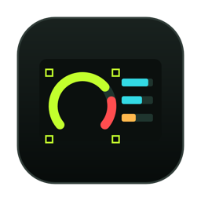
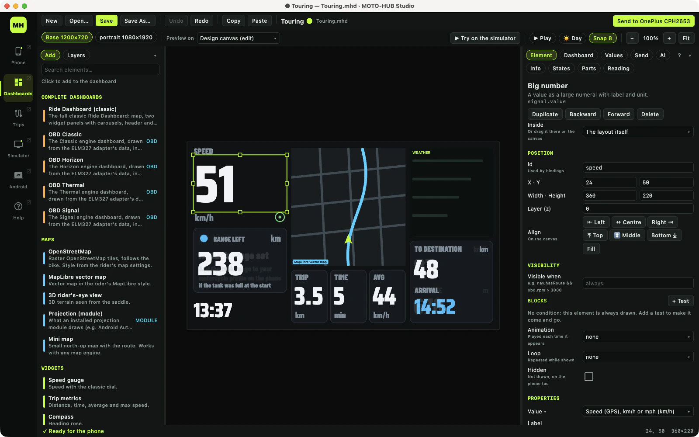
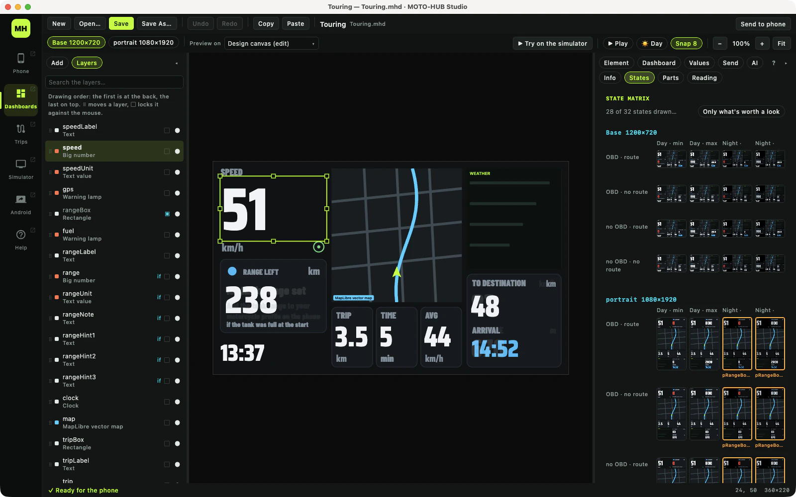
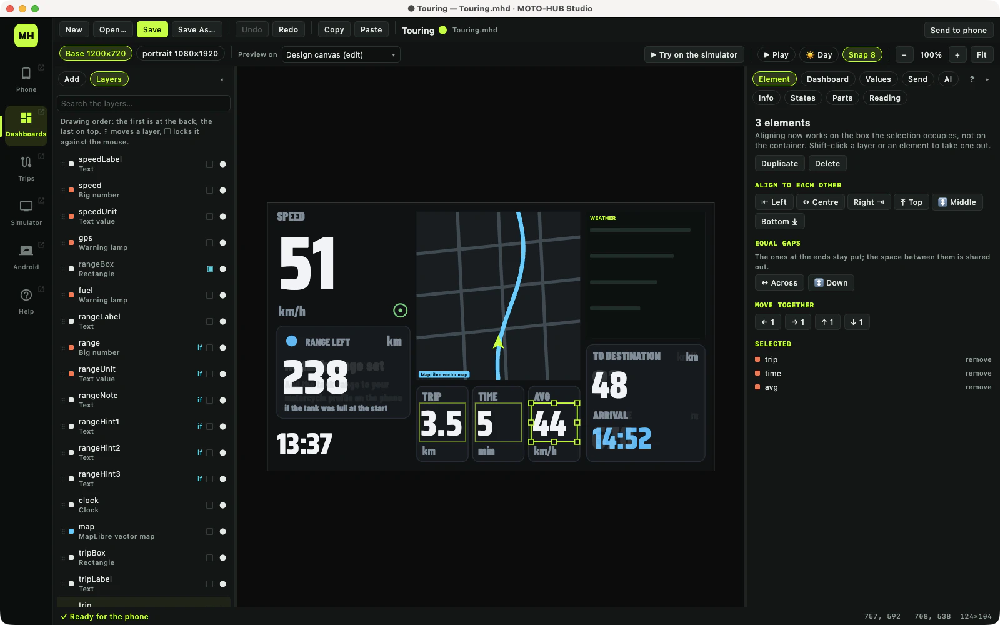
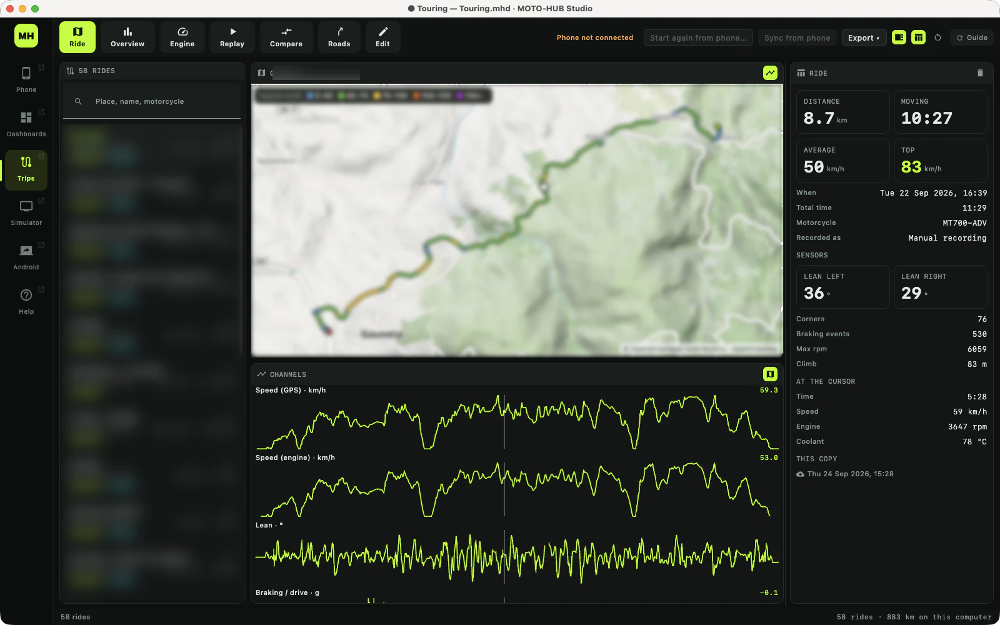
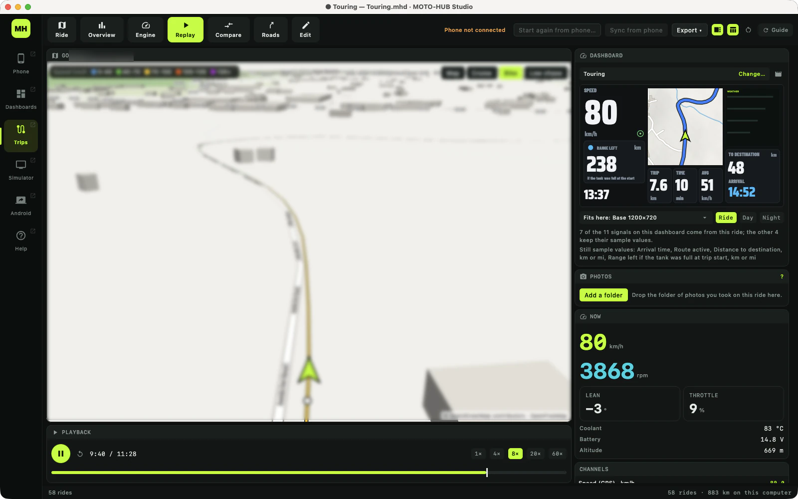
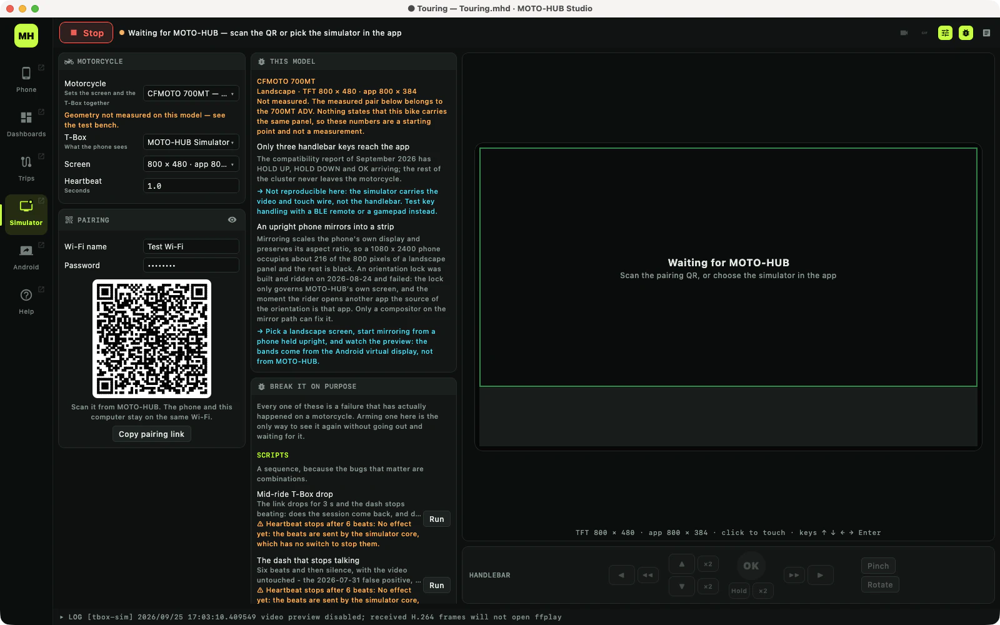
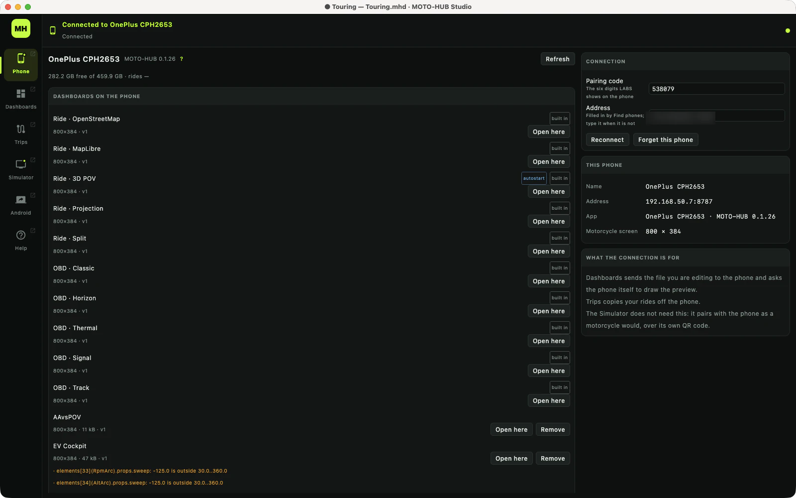
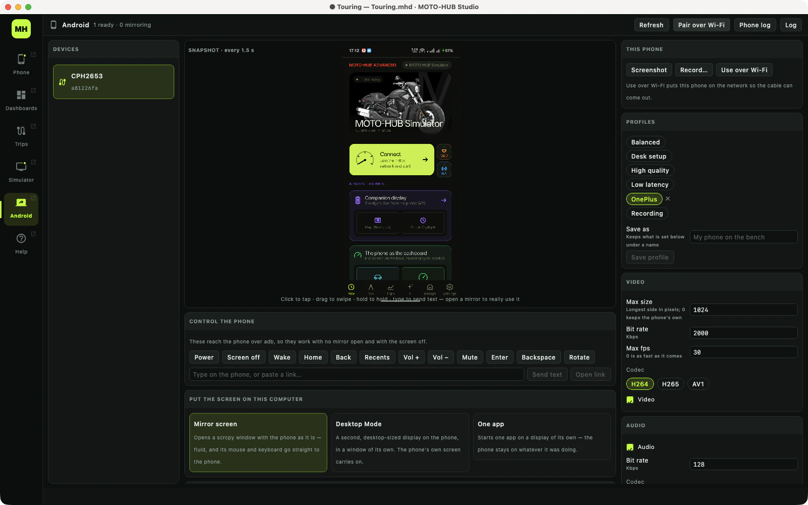

# MOTO-HUB Studio

**The desktop companion of MOTO-HUB, for macOS and Windows.** 
**Design dashboards for your motorcycle's TFT, study every ride you have recorded, and test it all on a simulated bike before you ride.**

> [!IMPORTANT]
> **MOTO-HUB Studio is in private beta and is not publicly available yet.** This repository holds its
> release notes only: there is nothing to download here. To try it, **[ask for the beta on Discord](https://discord.gg/FzhXZtPhC8)**.

---

## What it is

[MOTO-HUB](https://motohub.techub.eu) is the phone app that puts navigation, ride recording and a full
engine readout on your motorcycle's TFT, or on the phone itself when the bike has no compatible screen.
**Studio is the other half, on your computer.** Everything MOTO-HUB shows on the bike can be designed
here, everything it records can be studied here, and the link between the two can be tested here
without starting the engine.

Studio talks to the phone over your Wi-Fi: it sends it dashboards, previews them live on the phone,
copies your rides off it and backs the whole phone up. No cable, no account, no cloud. Your rides stay
on your phone and your computer.

## What it does

Six workspaces, one per job, down the left edge of the window. Any of them can be pulled out into a
window of its own, so a dashboard can sit on one screen while the simulator plays it on the other.

### 🎨 Dashboards: a real editor for the TFT

Design the screen your motorcycle shows, element by element: speed, maps, 3D rider's-eye view, engine
data from an OBD adapter, turn-by-turn, lap timer, lean angle, weather and more, **62 elements** in all.
The canvas works in the dashboard's own units, so one file fits TFTs of different sizes, and extra
layouts cover portrait or ultra-wide screens.

- **Every state at once.** Day and night, with and without engine data, navigating or not, every value
  at its extremes: a matrix draws the whole dashboard in each state, so the bugs that only show up on
  the road are found at the desk.
- **Readability, measured.** Studio knows the size of the TFT and how far away your eyes are, and flags
  every figure too small to read at riding speed, with the fix.
- **Conditions without code.** "Show this when OBD is connected and the revs are above 3000" is two
  blocks, not an expression.
- **Components.** Save a gauge you are proud of and reuse it everywhere; improve it once and update every copy.
- **An AI assistant.** Describe the dashboard you want and it builds it with the editor's own tools, one
  undo step per request. It works with any OpenAI-compatible endpoint, including local models.
- **Send to the phone** in one click, and watch a live preview drawn by the phone itself.

&nbsp;

### 🏍️ Trips: every ride, studied

Sync the rides MOTO-HUB recorded on your phone (both ways, with edits travelling back) and look at
them properly on a big screen.

- **Ride:** the track coloured by speed, every sensor channel on one timeline, and a cursor that moves
  map and charts together.
- **Replay:** the ride played back on a real map, from above or in 3D behind the rider, **with any of
  your dashboards playing along** on the data you actually recorded.
- **Overview:** the whole season at a glance, a heat map of where you ride most, service reminders by
  kilometre.
- **Engine:** time at each rpm, gear usage, temperatures and charging, from the OBD adapter.
- **Compare and Roads:** two rides side by side, every corner detected and matched across your library
  ("this corner, the last six times"), and timed segments.
- **Your dashboard over your footage:** pick the video you filmed on the ride, and Studio draws your
  own dashboard over it, driven by the ride's data.
- Export tracks as **GPX** or **KML** and the sensor log as **CSV**.

&nbsp;

Place names and maps are blurred in these pictures: they are the author's own rides.

### 🖥️ Simulator: a motorcycle on your desk

A simulated T-Box and TFT that MOTO-HUB pairs with exactly as it would with a real bike, from the same
pairing QR code. Pick the motorcycle model and the simulator takes its screen size and its known quirks.

- **Try a dashboard on the simulated TFT** straight from the editor, with the handlebar keys under it.
- **A test bench:** inject the faults real bikes produce (dropped packets, latency, a link that
  goes down), replay recorded sessions with checks, and record the phone, the TFT and every log into
  one file on one timeline.

### 📱 Phone and Android

- **Phone:** pair once, then see what is on the phone: its dashboards (open any of them in the editor),
  its modules, a full backup of the app, and how fast the link really is.
- **Android:** the phone on your desk over adb and scrcpy: mirroring, wireless pairing from a QR code,
  a remote control that works with the screen off, a logcat that understands MOTO-HUB, and a check of
  every permission the app needs.

&nbsp;

### ❔ Help

The version you are running, updates in one click (Studio updates itself on macOS and Windows), a
diagnostics file to attach when something goes wrong, and a complete user manual with search.

---

## How to get it

**MOTO-HUB Studio is in private beta.** It is not publicly available yet, and there are no download
links in this repository.

To try it, **join the [MOTO-HUB Discord](https://discord.gg/FzhXZtPhC8) and ask for the beta.** Testers
receive it there, and from then on Studio keeps itself up to date.

## Requirements

| | |
|---|---|
| **macOS** | Apple Silicon (M1 or later) |
| **Windows** | x64, portable zip with its own Java, nothing to install (tested less than macOS) |
| **Phone** | [MOTO-HUB](https://motohub.techub.eu) on Android, with **Settings ▸ LABS ▸ Dashboard editor link** turned on, on the same Wi-Fi |
| **Optional** | an ELM327 Bluetooth adapter for engine data; `adb` and `scrcpy` for the Android workspace |

## Release notes

Every version, from the first one, is on the **[Releases](https://github.com/vincenzobpt/MOTO-HUB-Studio-releases/releases)**
page. The releases carry notes only, no packages.

## Related

- **[MOTO-HUB](https://motohub.techub.eu)**: the website, with the phone app and the dashboard gallery.
- **[MOTO-HUB SOLO](https://github.com/vincenzobpt/MOTO-HUB-ADV-SOLO-releases)**: the Android app Studio works with.
- **[MOTO-HUB CORE](https://github.com/vincenzobpt/MOTO-HUB)**: the free, open-source (AGPL-3.0) MOTO-HUB for the motorcycle TFT: pairing with EasyConn / Carbit dashboards, Android Auto, screen mirroring and handlebar buttons, on Android 12 and newer.
- **[Discord](https://discord.gg/FzhXZtPhC8)**: help, the beta, and the people who ride with MOTO-HUB.
